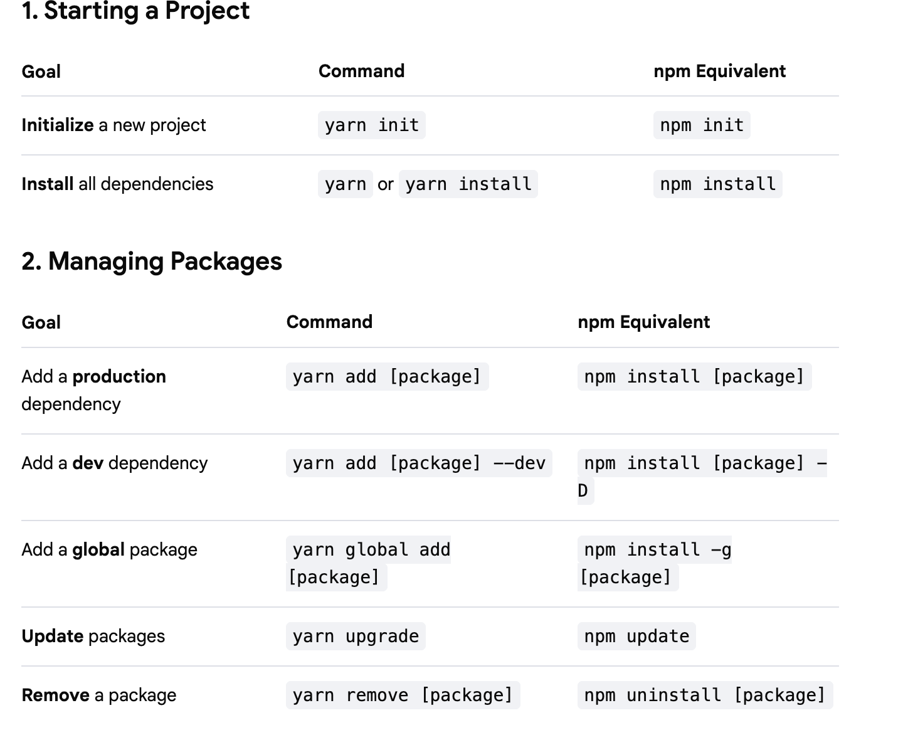
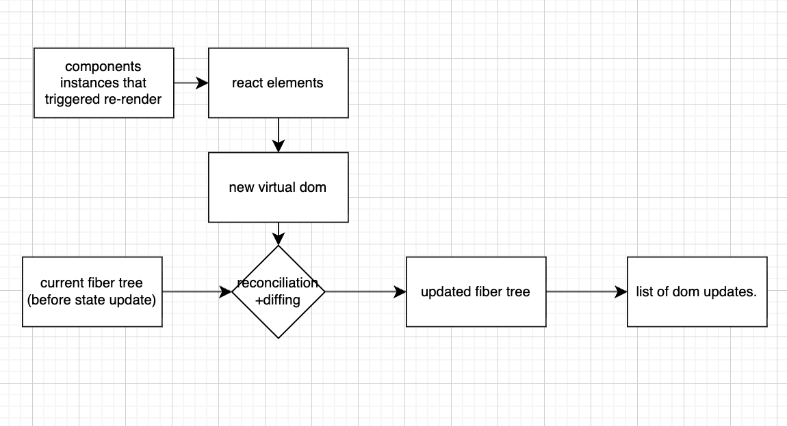
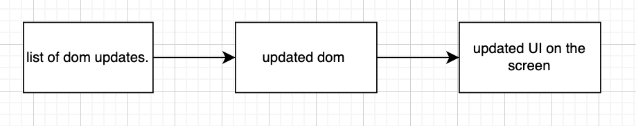
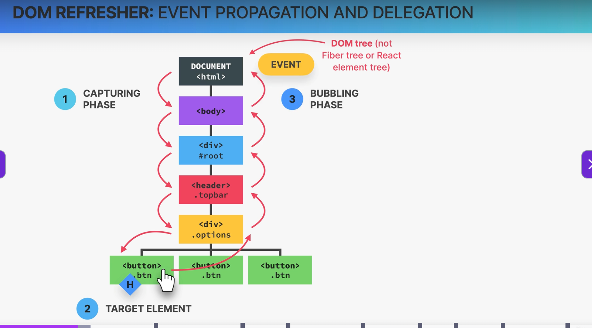
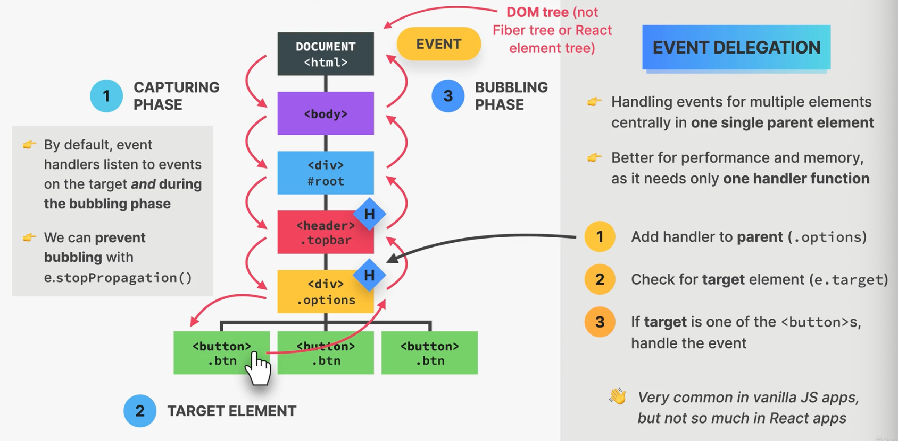
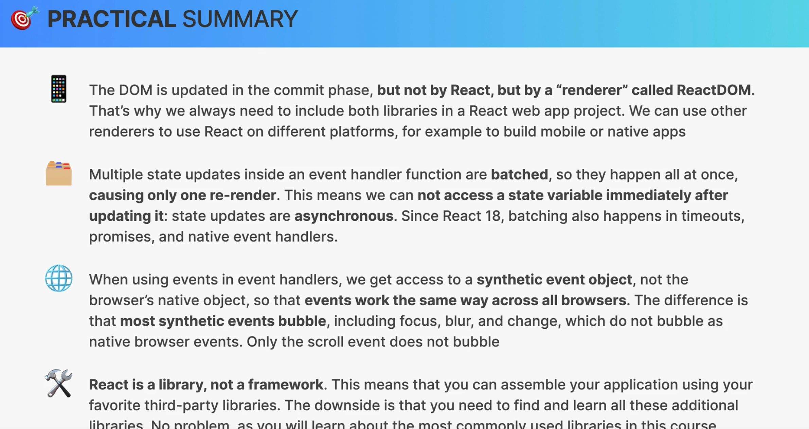
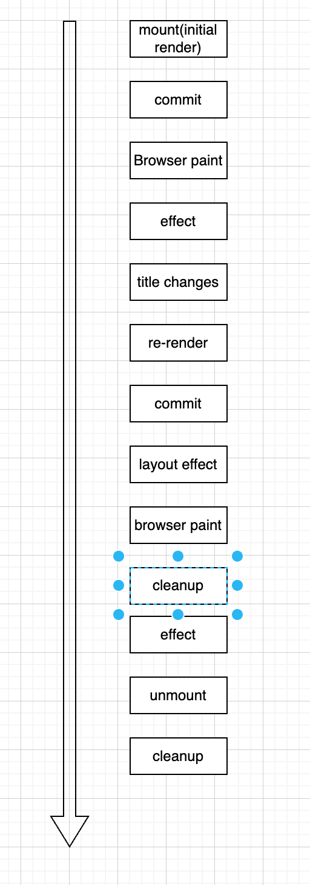
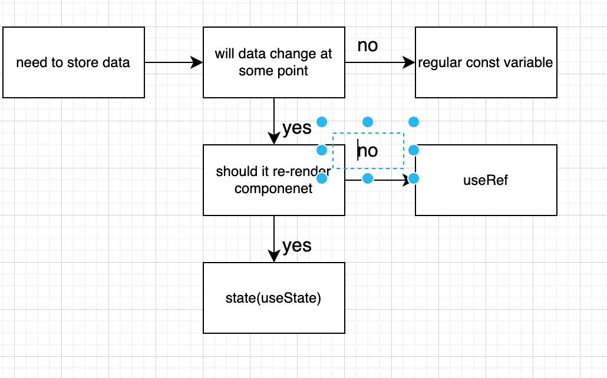

- some basic yarn commands:
  
  

# react components,react instances and react elements

- react component: a regular javascript function taht we write to describe a piece of ui. it returns a react element(element tree), usually writtenas jsx.

it could be considered as a blueprint or a template to build a ui component which then used to create one or more react component instances

- react component instances: are just one object or an insatnce of an components used.
  eg: <tab> in our application is an insatnce of a component.
  it is a physical manifestation of a component that react uses to internally call the components

- each component has its own state and props. it has its own lifecycle and can be born, live or die
- react component instcne returns a react elements.
- react consists of many jsx component and they are internally converted to react.createElement() function calls.
- the react element is a result of these function calls. teh react element is a simple large immutable js object that react keeps in memory.
- a react element contains all the information necessary to create a DOM elements. this react element is what is converted to DOM element(html) and showed in the browser

component->component instances-> react element-> dom element

- the react elemts has something called the $$typeof which prevents the cross site cripting attcks and automatic escaping of data.it is a primary security feature provided by react. in reactwe have a primitive called Symbol which cannot be transmitted via a json api call. this is ensured by the $$typeof
  eg:
  console.log(<DifferentContent test={23}></DifferentContent>); //react element of type DifferentContent
  console.log(DifferentContent());
  // react element of type div which is not actually what we need. hence we use <DifferentContent/> instead of DifferentContent()

- when we call a react component directly then it will no longer have a component instance. the state that such directly called compoennt is managed direcly under the parent component.
- all the components should manage their own state and props.

# how rendering works overview:

- components are built as we build our application . each of teh components are inside someother components and at the end all are under one coponents called the app component.
- if we are using multiple times then for each component has its own component instances. each component instance ahs its own jsx which calls the React.createElement() function and creates its own ReactElement which gets converted to DOM element and finally gets shown in the user interface.

# how components are displayed on teh screen:

- each time when a new render is trigeered then we enter the render phase.
- in render phase react calls component functions and figures out how DOM should be updated.
- upuntil now the state is not changed.
- in react rendering is not updating DOM or displaying elements on the screen. rendering only happens internally inside react, it does not produce visual changes.
- render phase and commit phase is used to bring o=about the DOM updation togetehr.
- in commit phase react actually writes to DOM, updating, insertinf and deleting elements to reflect the current state of the ODM
- now thw browser will understand tehre is a change in the state and it repaints the ui again

render triggered-> render phase-> commit phase-> broser render teh new changes

# how render is triggered:

- 2 situations triggers renders:

1. initial render of application
2. state is updated in one or more component insatcnes(re-render)

- render process iss trigered for an entire application that does not mean the entire DOM
- in react rendering means calling the component function and figuring out what state should change in the DOM later.
- react looks at the entire tree when a rerender happens
- renders are not triggered immediately, but scheduled for when the js engine has some "free time".but this happens in few milli sec. there is also batching of multiple setState calls in event handlers

# render phase:

# note:

- rendering is all about calling functions and not about updating DOM
- react does not completely discard old view on re-render.

- in begining of render phase react takes all the component instances in the entire component tree that triggered a re-reder and actually render them ie., call the corresponding component function
- this creates updated react elements which make up the so called virtual DOM

component instnces that triggered rerender is collected-> react element is created(also called virtual dom)->

- virtual dom: is a tree of all teh react components created form all instances in the component tree. its relatively cheap and fast to create multiple trees.
- these component trees are first converted to react element trees which constitute teh virtual dom.
- suppose lets say a change of state in a component in the component tree. then a new react element tree is created with the updated react element only for teh changed component.
- whenever react renders a component then it causes all of its child components to be rendered as well no matter their props are cahnged are not.
- if we update teh highest component in a component tree then it will affect all of its child and their childs as well.
- note that the component tree does not change for all the childs only the react element is rendered for all the child in case of a changed parent.
- this creates a new virtual dom and this new virtual dom will get reconciliation with the current fiber tree before state update.
- this reconciler is called fiber. this reconcilation creates a supdated fiber tree.
- react reuses as much of existing Dom as possible. this is where reconciliation comes to picture. deciding which dom elements actually need to be inserted, deleted or updated in order to reflect the latest state changes.
- the result of reconcilitation is the process of function calls changing a particular DOM and presenting it.

# reconciler

- the reconciler or the fiber takes the react element tree and builds a fiber tree on initila render.
- the fiber tree: is a special internal tree where for each element there is something called as a fiber.
- this fibers are not recreated on every render. it is simply rerendered over nad over again in every reconciliation step
- this makes the fibers the best choice to keep track of current state, props, side effects and used hooks
- the fiber has its own que of work to do like changeing current state, maintaining props, maintaining side effects, keeping track of used hooks.
- hence fiber is called the "unit of work"
- the structure of a raect element tree is based on parent child relationship, where as the fiber tree is a sibling relationship ie., each first child alone will have a relationship with their parent and all other children will have relationship with only the connected sibling.
- both trees includes not only the react compoennets but also other DOM elements like <h3> etc.,
- in fiber tree rendering can be done asynchronously. all this happens automatically behind the scenes.
- so redering can be split into chunks, tasks cna be prioritized, and work can be paused, reused or thrown away.
- it enables concurrent features like suspense or transitions.
- it does not pause or disturb the browser react enginer incase of a long render.

- when a change happens in a component then the component along with its children will be rendered again. this will then be reconciled with the initially generated fiber tree. this creates a new updated fiber tree showing diffreence to those rendered components alone

- the initial current fiber tree compares each element of the element tree and this postition wise comparing is called Diffing.
- once the new updated fiber tree is created there will be a series of dom manipulations for each element in the work In progress or updated fiber tree.
- the dom manipulations are taken into a,list and provided to the next phase called teh commit phase.
  

# commit phase

- phase where react writes , updates, deletes , inserts to the dom
- writing to dom happens all in one go. ie., it is synchronous. it cannot be interrupted and so the DOM never shows partial results, ensuring a consistent UI(in sync with the data all the time.)
- rendering can be paused, resumed and deleted asynchronously and all these changes are recorded to flush these changes in one go in the commit phase.
- after the commit phase completes , the workinprogress fiber tree becomes the current tree for the next render cycle. this saves time.
  note: the fier tree is never actually completely rendered.
- after all this when ract gets time it will paint on the browser
  

- the render phas eis done by react and teh commit phse is done by a library called reactDom and the browser just paints the updated react components.
- in fact react itslef will never touch teh DOM. react only does teh renders phase. this makes react to be useful indifferently with all the web browsers
- react DOM - useful to paint on brsers like edge , chrome ec.,
- we cna use react native to build ios applications
- we can use Remotion to create videos
- there are some other renderers to do some word, pdf, figma.
  but note taht renderer does not render. they commit the result of render pahse.

# how diffing works:

- diffing uses 2 fundamenta; assumptions(rules):

1. 2 elements of different tyes iwll produce different trees.
2. elements with a stable key prop stay the same across renders.

- diffing is comparing elements step by step between two renders based on their position in the tree. here we can come across 2 different situations

1. 2 different elemets at the same position in the tree between 2 renders.

- this means type of the elmet has changed. in this case react assumes entire sub-tree is no longer valid.
- old components are destroyed and removed from DOM, including state. they will be replaced with the new component and its child at the same position as the previous one in the tree.
- if the child element remains the same between the two components before and after the render then the tree might be rebuilt. the tree gets rebuilt with brand new elements. if there is an element with a state then that state will not be re-rendered.

2. having the same element at the same position in the tree

- if we have same element before and after a render at teh same position in the tree then the element as a child element along with its state
- the same element at the same position preserves the state and mutate the dom elemnt attributes and if in case of react elements it will retain the state

- when we dont want this action then only key prop comes into play.

# key prop

- special prop that we use to tell the diffing algorithm taht an element is unique.
- this allows react to distinguish between multiple instances of teh same component type.
- when a key stays teh same across renders , the element will be kept in the DOM(even if the position in the tree changes).
  1. using keys as props in lists
  - when a key changes between renders, the element will be destroyed and a new one will be created. if ithe keys does not change then the dom will remain teh same
  2. using keys to reset state

eg:

1.  before render
    <ul>
    <question question={q[1]}>
    <question question={q[2]}>
    </ul>
    after render

        <ul>
          <question question={q[0]}>
          <question question={q[1]}>
          <question question={q[2]}>
        </ul>

    position of q1 and q2 will be changed in teh tree. i.e, same question elementbut different position in tree. so they will be removed and recreated in the Dom

2.  before render
     <ul>
         <question key ='q1' question={q[1]}>
         <question key ='q2' question={q[2]}>
       </ul>
       after render

       <ul>
         <question key ='q0' question={q[0]}>
         <question key ='q1' question={q[1]}>
         <question key ='q2' question={q[2]}>
       </ul>
    though same element changed to different postionhere key remains the same . so the elements will be kept in dom

3.  using keys to reset state
    eg:
    before render
    <QuestionBox>
    <Question
    question={{
        title="react is my favourite"}}
    />
    </QuestionBox>
    after render
    <QuestionBox>
    <Question
    question={{
        title="java is my favourite"}}
    />
    </QuestionBox>

- in teh above case teh element is same and it will not change its position before and after render. so the state will not change too and will show "react is my favourite". but if we want it show the satte difference then the we need. akey prop with cahnging key
  eg:
  <QuestionBox>
  <Question
  question={{
        title="react is my favourite"}}
  key={24}
  />
  </QuestionBox>
  after render
  <QuestionBox>
  <Question
  question={{
        title="java is my favourite"}}
  key={25}
  />
  </QuestionBox>

# rules for render logic pure components

- 2 types of logic that we can write in react components:

1. render logic:

- it is teh code that lives at the top level of the component function
- it participates in describing how the component view looks like
- they are executed every time the component renders.
  eg:
- definition of the states and the return statements , the functions that is used in the return statements excluding the event handlers

2. event handler fucntions:

- executed as a consequence of the event tahta the handler os listening for
- code that actually does things : like update of state, perform an HTTP request, read an input field, navigate to another page etc.,
- react requires that components are pure when it comes t render logic in order for everything to work as expected.

# functional programming principles:

- a side effect happens when a dependdency on or modification of any data outside its scope.
  eg:
  mutating external variables , HTTP requests, writing to DOM

const areas={}
function circleArea(){
areas.circle=3.14*r*r; //outside teh circle variable mutation
}

pure functions:
are teh functions that has no side effects. it does not change any variables outside its scope.

- given the same iput , a pure function always returns the same output.

eg:
function circleArea(r){
areas.circle=3.14*r*r;
}
//if r is same return is always same. so it is pure

function circleArea(r){
const date=Date.now()
const area=3.14*r*r;
return `${date}`
}
//impure as date changes every time

# rules for render logic pure components

- components must be pure when it comes to render logic: given the same props (input), a component instance should always return teh same JSX(output)
- render logic must produce no side effects: no interaction with the outside world is allowed. so in render logic that runs in teh top level it should not interact with anything outside.

1. this includes it should not perform network requests(API calls)
2. should not start timers.
3. should not directly use the DOM API
4. do not mutate objects or variables outside of the function scope. this is why we cannot mutate props
5. do not update state or refs: this will create an infinite loop

- these side effects are only forbidden in render logic and not everywhere. so we can have side effects in event handlers. there is also a special hook to register side effects(useEffect)

# how state updates are batched

- renders are not triggered immediately but scheduled for when the js engine has some " free time". ther is also batching of multiple setState calls in event hanlders.
  eg:
  //event handler function
  const reset=function(){
  setAnswer('')
  console.log(answer)
  setBest(true)

  setSolved(false)
  }
  updating multiple pieces of sate wont really cause re-render immediately after updating one piece of state. all pieces of satet are updated in one go
  - then one render +commit happens

# updating state is asynchronous:

eg:
const reset=function(){
setAnswer('')
console.log(answer) ####statement2
setBest(true)

setSolved(false)
}

- component state is stored in the fiber tree during the render phase
- at statement 2 re-render has not happened yet. therefore answer still contains current state , not the updated state('')
- there ore this state is called stale state.
  a state update will only be reflected only after re-rendering is complete
- updating state in react is asynchronous.
- this also applies when only one state variable is updated.
- if we need to update state based on previous update, we use setState with callback function (setAnswer(answer=>...))
  
- batching works differently for different version of react.
- we can opt out of automatic batching by wrapping a state update in ReactDom.flushSync() function

Note: automatic batching was not happeneing before react 18

# how react handles events

# event propagation and delegation

- initial a dom tree will be created and when a event is triggered then a even is created in the top level like Documnet<html>. then it moves down to the target element. this is called capturing phasse
- next comes the target element phase where in the event will be handled by the event handler at the target and then it will be moved to the to the Document level once again.
- this is called bubbling phase, in which the event travels through all the elements one by one.
- by default event hanlders will listen to events not only in the target but also during all the otehr elements in the bubbling phase as well.
- every single event handler will be executed in all the elemnets as long as they have the same event handlers.
- but some times we dont want this behaviour. so we use the stop propgation method to avoid doing so.

# event delegation:

- is a process that captures this bubbling and capturing phase behaviour of events and handling events for multiple events centrakky in one subgke parent element.
- if we want to handle the same event in multiple sibling events then we can add the evnt handler function in tehir nearest neighbour.
- check if the event is triggered from one of the target elemnet using (e.target)
- handle the event from the central element.
  

# how react handles events:

- when we attach a handler to a element then what happens behind the scenes is that it does not attach it to the target element instead it attaches it to the #root element
- that root element is the dom component in whch teh react component is displayed.
- react registers all event handlers on the root DOM container. this is where all events are handled. if we use the default fo create react App then that will be the #root element.
- react physically registers one event handler function per event type and it does so at a root node of the fiber tree during the render phase.
- react performs event delegation for all events in our applications.
  

- so when a event is triggered it will traverse from teh Document element all the way to teh target and it will bubble up to the roo where all the events will be handled.
- once teh event is handled it will again continue to bubble up to the Document.

# synthetic events:

- eg:
  <input onChange=(e)=>setText(e.target.value)/>
  in vanilla js we will have access to native Dom event object like PointerEvent, MouseEvent,KeyboardEvent etc.,
- but in react will give us access to a synthetic events which is a wrapper around a native event objects.
- these syntehtic events has the same interface as a native event objects, like stopPropagation() and preventDefault()
- the synthetic events fixes browser inconsistencies, so that events work in he exact same way in all browsers.
- most synthetic events bubble(including focus, blur and change), except for scroll.

# event handlers:

- in react eventhandlers are in camel case but in vanilla js it is in all small case
- in vanilla js the default behaviour can be stopped by returning a false but in react the default behaviour is prevented using preventDefault() function
- in react we can attach capture if you need to handle during capture phase eg: onClickCapture.

# react

# life cycle of a components instance:

1. mount/initial render - component instance is rendered for teh first time. fresh satte and props are created.
2. re-render- happens when there is a state change, props change, parent component re-renders, context changes
3. unmount- a point where the compoennet is no longer needed. so the component instance isdestroyed and removed adn teh satte and props are destroyed.

# how to fetch data:

- if we are using some fetch endpoints then it means we are interacting with the external environment. it also creates a side effect.
- such things should not be there in the render logic. the render logic should not contain change in prop, state,etc., however we can have these changes in useEffect or EventHanlders.
- if w ehave such fetch of data statements from the oustide environment in the render logic , then as teh render logic is executed for every singl render. this will be re-runnned over nad over again.
- useEffect hook is to execute the side effects without entering a infinite loop.Note that the data fetched from useEffect will be executed after certain renders.

- useEffect(effect_function(),dependency array)

  effect function will be a anonymous function or some function that will be executed after some renders. where as the dependency array could be [] empty array which means the function will be executed after the first mount of the component where useEffect is described

# a first look of side effects

# side effect:

- is basically any interaction between react component to the external world outside the component. we can also think of a side as "code that actually does something"
  eg:data fetching, setting up subscriptions, setting up timers, manually accessing the ODM etc.,
- side effect should not happen in the render logic and hence we use them inside useEffect or event handlers.
- event handlers are triggered by events like onCLick, onSubmit etc.,
- simply reacting to events may not alwaysbe the need , hence we can have the side effects inside the Effects . these are triggered by rendering.
- by creating an effect, it basically allws us to write code that will run at different moments: like mount, re-render or unmount.

eg:
useEffect(function(){

fetch("http://www.omdbapi.com").then((res)=>res.json()).then((data)=>setMovies(data.Search));
return (()=>console.log(`cleanup`));

},dependency array)

- each useEffect can have 3 things

1. the effect code or function
2. the cleanup function-> a function that will be returned by the effect fucntiomn
3. dependecy array

- the reason why useEffect exist is not torun the side effects at different cycles of the componnet instances life cycle, but to keep a component synchronised with some external system.

# using an async function

- basically the effect function is a callback function, that is synchrnous to prevent race conditions.
- basically if we try placing a effect function inside the useEffect cannot return a promise but the async funtion returns one.
- but if in case you wnat an. async function then you can use a normal function and define the async function inside it
  eg:
  eg:
  useEffect(function(){

  async function fetchMovies(){
  const res=await fetch("http://www.omdbapi.com")
  const data= await res.json();
  setMovies(data.Search)

  }
  fetchmovies();

},[])

- an effect runs after each and every render. we can prevent that by passing a dependancy array.
- but why does useEffect require a dependency? without dependency array, react does not know when to run the effect.
- each time one of the dependencies chnages, the effect will be executed again.

# what are effect dependencies?

- effect dependencies are the state varibales and props used inside the effect and must be included in the dependency array.
- if we dont include them to the dependency array then we get a error called "Stale closure"

# useEffect

- useEffect is a event listenet that is listening for one dependency to change. whenever a dependency chnages, it will execute the effect again
- useEffect is a synchronisation mechanism.
- effects react to updates to state and props used inside the effect(the dependecies). so effects are reactive (like state updates re-redering the UI)

dependecies:[title,userRating] -> forms the dependency array

any change to dependencies the effect will be executed again

- effects are used to keep teh system synchronised with the external code. the state and props of teh component are synchronised with the external system. updating the title in some other way will not update the userRating

eg:

1. useEffect(fn,[x,y,z]) - synchronises with x, y and z - runs on mount(first start) and re-renders triggered bu updating x,y and z

2. useEffct(fn,[])- effect does not synchronize with any state or prop - runs only on mount(ibitial render)

3. useEffect(fn)- effect runs on every render i.e., with everything

# when effects are executed ?

- effects are executed after render.
- actually speaking effects run asynchronously and it runs after the render is painted on the browser.
- effects may contain long running process like data fetching. hence it runs after the render. so that the user may not have. apropblem.
- if an effect sets state, an additional render will be required.
  

eg:
useEffect(function () {
console.log("A");
}, []);

useEffect(function () {
console.log("B");
});
console.log("C");

o/p: CAB

- since C is a part of redner logic it will be given first . then if it is teh initial render then as per the order of arrival first A and then B will be executed.

o/p: CB

- C is rendered first as its a part of render logic. then if there is a change in state then A will not be executed as it is not allowed to be executed if there is a chnage in any state. as it tracks no state. finally B will be executed.

# cleanup function:

- the clean up function is a part of the useEffect and the cleanup function will br triggered after unmounting adn after the painting of one effect which was triggered by some state changes.
- the cleanup function is a function that cna be returned from an effect
- component renders only when execute effect if dependency array includes updated data.
- component unmounts then only execute clean up function.
- we need a cleanup function whenever the side effect keeps happening after the component has been re-rendered or un-mounted.
  applications:
  
- clean up functions can also be used to stop multiple requests whenever there is a change in the state
eg:
useEffect(function(){
  const controller=new Abort
})

- closure: it is a mechanism that allows a function to always remember all the variables it accesses like state and prop from its specific render's scope, even after that render function has finished executing. this is how functional components mainatain state and functionality across re-renders without using classes or global variables.

# key press event
  useEffect(
    function () {
      function callback(e) {
        //callback function with event listener
        if (e.code === "Escape") onCloseMovie();
        console.log("CLOSING");
      }
      // using useEffect to communicate with external events
      document.addEventListener("keydown", callback);
      // if we have more number of movie dey=tails being closed then it will add more event listeners to the lsit
      return function () {
        document.removeEventListener("keydown", callback);
        //if we are removing a specific type of event listener then the same function should be given as a call back for the removeEVentListener too
      };
    },
    [onCloseMovie],
  );

# react hooks and their rules:
- special functions that are built into react that allow us to hook into react internals.
- it heps in creating and accessing the satte from teh fiber tree or registering side effects in the fiber tree.
- fiber trees are not accessible to us but the react hooks like useState and useEffetc help us hook into them
- it also can help in manual DOM selections.
- all hooks start with use. we can also create custom hooks composing of multiple hooks
- hooks give he function components the ability to own state and run side effects at different lifecycle points 

# overview of all built-in hooks:
- useState
- useEffect
- useReducer
- useContext

less used hooks
- useRef
- useCallback
- useMemo
- useTransition
- useDeferredValue
- useLayoutEffect
- useDebugValue
- useImperativeHandle
- useId

only for libraries:
- useSyncExternalStore
- useInsertionEffect

# rules of hooks:
- hooks can only be called at the top level. ie., we cannot call hooks inside conditions, loops, nested fucntions or after an early return.
- this is necessary to ensure that hooks are always called in th same order.
- hooks can only be called from react functions ie., can be called inside a function component or a custom hook but not from regular functions and class components
- these rules are enforced in ESLint rules.

# hooks rely on call order:
- whenever there is a trigger react creates an element tree also called the virtual dom
- on the initial render from the react element tree a fiber tree will be created
- the fiber tree consists of group of fibers. which contains props, linked list of all the hooks used

- the linked list hooks have the hooks are created based on the order of they appear

eg:
const [a,setA]=useState(23)
if(a===23)
  const [b,setB]=useState("")
useEffect(fnz,[])

list built on hooks call order:
state A-> state B-> Effect Z 

- suppose say a render happens because A=7. the state b is created only because A=23. but when A is changed state B will not be there

state A-> X state B X-> effect z

- this completely breaks teh hooks and destroys teh tree. note taht the fiber tree will not be created for every render. it will be created only if there is a change in the position of the element and it could not be recreated from the current tree.

- this is why hooks need to be called from the top level and how it preserves the same order 

# summary of defining and updating state
- creating state:
 simple way eg: const [count,setCount]=useState(23)
 based on function ie., lazy evaluation 
 const [count,setCount]=useState(()=>localStorage.getItem("count"))

 - the call back function is called only during the initial render adn it should be a pure function and should not accept any arguments

- updating state: 
  simple way: setCount(200)
  absed on current state: eg: setCount((c)=>c+1)
  function must be pre and return next state

  - in case of updating objects donot mutate the objects, just replace them.

# why we need refs in react
- ref hooks are used to select the dom elements. without using them we can only manually select dom elements
eg:
function Search({ query, setQuery }) {
  useEffect(function () {
    // manually selecting dom element. which is not the style of react we need ref
    const el = document.querySelector(".search");
    console.log(el);
    el.focus();
  }, []);

- ref is a Box object with a mutable .current property that is persisted across renders ("normal variables are always reset")
- 2 big use cases:
1. creating a variable that says the same between renders (eg., previous state,setTimeout id, etc.,)
2. to select and store the DoM elements . we cna preserve the dom elemens across the renders.

- refs are for data that is not rendered: usually only appear in event handlers or effects, not in JSX
- if we have a element that is rendered or painted then its a potential cnadidate for state and not refs

- just like teh state we are not allowed to write or read .current in render logic. 

# state vs refs
- state and refs are persisted across renders
- updating the state will cause the re-render adn updating refs will not result in re-render.
- state is immutable but refs are mutable
- state is updated asynchronously i.e., the changes value is not available immediately. but refs are not updated asynchronously
# state management

# refs to select dom element
// component
function Search(){
  const inputEl=useRef(null);
  useEffect(function(){
    // to make the ref hook follow the dom after every mount
    inputEl.current.focus()
  },[])
  return(
    <input classname="search"
    type="text"
    ref={inputEl}/> //declaring the this is the dom that is referenced
  )

}

# custom hooks
- in react we can only reuse 2 things:
1. ui - to reuse a ui we have components
2. logic - if the logic does not contain any hooks then its simple regi=ular function that could be reused
- if the logic contains some react hook then we cannot extract them to a regular function. then we have to create a custom hooks.
- custom hooks allow us to reuse non-visual logic in multiple components
- one custom hook should have one purpose, to make it reusable and portable across multiple projects.
- rules of hooks are also applicable to custom hooks
- custom hook is a javascript function so it can receive and return any data that is relevant to custom hook.
- normal functions and components return some jsx but custom hooks can even return an object or an array if it is relevant.
- custom hooks need tp use one or more react hooks.
- custom hooks name also start with "use"