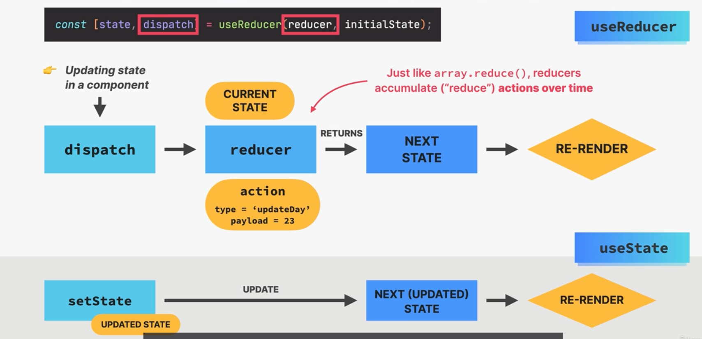

# useReducer
syntax:
function useReducer(state,action)
{
    //takes current state and action  and return the next state. the action comes form the dispatch function call and teh state comes from the initial state.
}

const [statevariable,dispatch_func]=useReducer(reducer_func,initial_state)

const handle(){
    dispatch(action)
}

- action object
eg:
 {
    type:"name of the action"
    payload:value of the action
 }

advantage:
 - all the possible sate updates can be cebtralised to one function for all the state variables adn for all the components

# why useReducer
- when components have a lot of state variables and state updates, spread across many event handlers all over the component.
- when multiple state updates need to happen at the same time (as a reaction to the event like "starting a game")
- updating one piece of state depends on one or multiple other pieces of state
in all these cases we can use reducer instead of useState

# state with useReducer
- an alternative way of setting state, ideal for complex state and related pieces of state.
- it takes in reducer function and an initial satte and it reduces a value to the state variable and a dispath function in an array
eg:
const [state,dispath]=useReducer(reducer,initialState)
- stores related pices of  state in a state object
- useReducer needs reducer: function containing all logic to update state. decouples state logic from component. so the reducer function is similar to the setState function
- reducer is a pure function i.e., no side efects are allowed. it takes current state and action and returns the next state.
- the action is simlpy an object taht defines how the object should be changed. it ususally has a type and a payload elements
- useReducer returns a dispatch function taht triggers state updates by sending actions from event handlers to the reducer function.

# how reducer state updates:
- after executing the reducer function the function have tore-render

- if we want to update states together or we have multiple states related to each other and it also includes some objects then we go for usereducer 

note:
- autorename tag is an extension used to change the tags like opening and closing tags simultaneously.
- command to install packaages :
npm i json-server
npm run server
json-server helps to create some temporary apis and get some responses out of it
