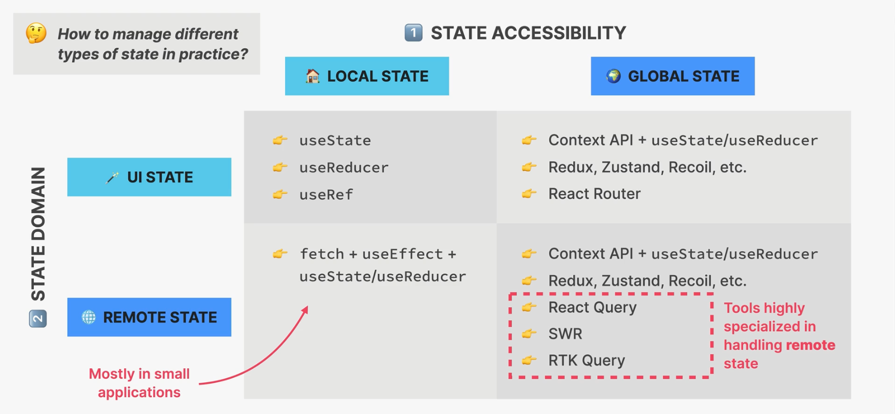

# context api:
- in any app we will ahve the situation where we will have multiple deeply nested child components. passing props through various child compoenets is cumbersome. this prblem is called prop drilling and the solution is that better component composition.
- but it is always not possible to have beter component composition. 
- so instead what we need is a directly passing some variables from parent to a deeply nested child component. for this only we have context api
- context api is used to pass data throughout the app without manually passing props down the tree.
- it allows us to broadcast global state to the entire app. we have
here we 3 things:
1. provider: gives all child components access to value
2. value:data that we want to make available(usually state and functions)
3. consumer: all the components taht read the provided context value. we can multiple consumers.

note: whenever context value is updated all the consumers will be rerendered. this way we can re-render the component instance as long as the component is subscribed to the context value.

# steps to implement context api
1. create a context
const PostContext=createContext()

2. provide value to child components
<PostContext.Provider 
value={
    {
        key:value pairs
    }
}>
    <>
    // rest of the child components
    </>
</PostContext.Provider>

3. remove the props from the child components and use this instead

function child_Component(){
    const {value1}=PostContext()
    <button onCLick={()=>value1()}>
}

# state management
- state management means giving the state a home. it also means when to use state, types of state accessibility local vs global.

# types of state:
classified based on 
1. state accesibility
- local state: needed only by few components. only accessible in component and child component.
- global state: needed by many components . accessible to every coponent in the application
2. state domain
- remote state: all application state loaded from a remote api server. - usually asynchronous and needs re-fetching and updating.
- ui state: everything else. usually synchronous and stored in teh application 
eg:
 theme, list filters , form data etc.,

# state placement options
- whenever we have a new place of state we need a state first there are 6 different options in it
1. if we want to place a local state in a local component the we will use the useSate, useReducer or useRef 
2. if we wnat to have a piece of state in multiple component then we will uplift the state and place it in a parent component. here also we make use of the useState, usereducer or useRef
3. not always the state comping to parent may not be the solution that is why we have global state . this uses context PAI aling with useState and useReducer. the context api is used mainly to manage the ui state and not the remote state
4. we can manage the global state using the 3rd party library like redux, react query,swr, zustand etc.,
5. we cna place the global state that is passed between the pages in the URL using raectrouter  
6. sometimes we need to store some data in the users browser . this case we can store things in the local storage and teh session storage.

# statemanagement tools options:

