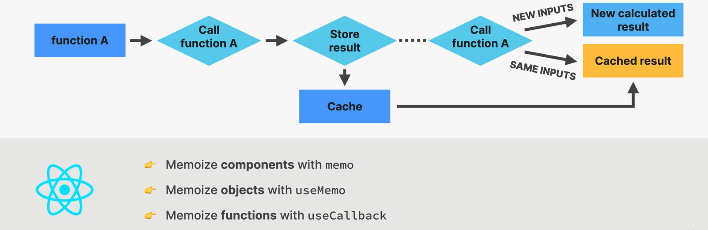

# context api:
- in any app we will ahve the situation where we will have multiple deeply nested child components. passing props through various child compoenets is cumbersome. this prblem is called prop drilling and the solution is that better component composition.
- but it is always not possible to have beter component composition. 
- so instead what we need is a directly passing some variables from parent to a deeply nested child component. for this only we have context api
- context api is used to pass data throughout the app without manually passing props down the tree.
- it allows us to broadcast global state to the entire app. we have
here we 3 things:
1. provider: gives all child components access to value
2. value:data that we want to make available(usually state and functions)
3. consumer: all the components taht read the provided context value. we can multiple consumers.

note: whenever context value is updated all the consumers will be rerendered. this way we can re-render the component instance as long as the component is subscribed to the context value.

# steps to implement context api
1. create a context
const PostContext=createContext()

2. provide value to child components
<PostContext.Provider 
value={
    {
        key:value pairs
    }
}>
    <>
    // rest of the child components
    </>
</PostContext.Provider>

3. remove the props from the child components and use this instead

function child_Component(){
    const {value1}=PostContext()
    <button onCLick={()=>value1()}>
}

# state management
- state management means giving the state a home. it also means when to use state, types of state accessibility local vs global.

# types of state:
classified based on 
1. state accesibility
- local state: needed only by few components. only accessible in component and child component.
- global state: needed by many components . accessible to every coponent in the application
2. state domain
- remote state: all application state loaded from a remote api server. - usually asynchronous and needs re-fetching and updating.
- ui state: everything else. usually synchronous and stored in teh application 
eg:
 theme, list filters , form data etc.,

# state placement options
- whenever we have a new place of state we need a state first there are 6 different options in it
1. if we want to place a local state in a local component the we will use the useSate, useReducer or useRef 
2. if we wnat to have a piece of state in multiple component then we will uplift the state and place it in a parent component. here also we make use of the useState, usereducer or useRef
3. not always the state comping to parent may not be the solution that is why we have global state . this uses context PAI aling with useState and useReducer. the context api is used mainly to manage the ui state and not the remote state
4. we can manage the global state using the 3rd party library like redux, react query,swr, zustand etc.,
5. we cna place the global state that is passed between the pages in the URL using raectrouter  
6. sometimes we need to store some data in the users browser . this case we can store things in the local storage and teh session storage.

# statemanagement tools options:

# performance optimization tool
- three important things in optimization is 
1. prevent wasted renders
- here we can prevent renders by memoize functions use memo and we can memeoize objects using useMemo and useCallback hooks
- we can also use a technique by passing elements as children or regular prop
2. imporove app speed/ responsiveness
- to imporve responsiveness usinf useMemo, useCallback and useTransition hooks
3. reduce bundle size
- we can reduce bundle size by using fewer 3rd party packages and we can use code splitting and lazy loading

# when does a conponent instance re-renders?
- in react a component is rerendered only in 3 cases
1. state cahnges in the component
2. context changes in the thing to which the component is subscribed to 
3. whenever a parent component re-renders then also the component will re-render.
- but note that when prop changes the component will not change. this means the real reason why a component re-render when its props re-render is taht its parent re-renders
- its important to know that when a component re-renders it does not mean that the dom is updated. it just eman s that the component function is called. but this is an expensive operation
- wasted render:is a render that did not produce any change in the DOM. so its a waste because all the diffing calculations has to be done with no use at all.
- this is only a problem when they happen too frequently or when the component takes a large time to update

# profiler
- if you wnat to record the reason why the re-render took so long , i meant whihc of teh three reasons 
inspect->profiler->profiler->check box to record why each component rendered while profiling
- then start recording

note:
- if we are passing a component as a children prop to another component then the other component will be built before rendering the child component. if the child component is slow or huge component then the rendering of teh child will not be dependent and redendered again and again for a change in the other component.
- the child component will be created before it is being passed into the otehr component. so until and unless if the child components are not taking any state from the otehr component the child component will not be rerendered

# memoization:
- it is an optiisation technique to execute a pure function once, and saves the result in memory. if we try to execute the fucntion again with the same arguments as before, the previously saved result will be returned, without executing the function again

- it helps prevent wasted renders and improve speed/responsiveness

# memo function
- used to create a component taht will not re-render when its parent re-renders as long as the props stay the same between renders.
- we use memo to create a memoized component.
- calling a function multiple times means rerendering a component multiple times.but memo makes the function call only if the props chnage between rendering.
- in regular behaviour if component rerenders teh child also will re-renders
- if we use memo then when component re-renders and props remain same then memoized child does not re-render
- if components re-renders with new props then memoized child re-renders.
- a memoized component will re-render only when its own state is changed or a context that itssubscribed to is chnaged.
- use memo only when component is heavy and slow and re-reders often.

eg:
const NewComponentName = memo(function OldComponentName{
    ----
})

- note in js {} !== {}. so if we are passing a object prop to the child component in react then irrespective of the fact that the value of each key vlaue remains teh smae the component will be re-rendered again.
- to avoid this only we have useMemo and useCallback hooks
- they are used to memoize vlaues (useMemo) and functions (useCallback) between renders
- values passed into useMemo and useCallback will be stored in memory and returned in subsequent re-renders as long as denpendencies stay the same.
- useMemo and usecallback have a dependency array . whenever a dependency change then the value will be recreated
- when can we use. useMemo.
1. when we dont want to do a large calculation agian and agin. 
2. when we have a large prop which takes in a object as a prop
3. when we dont want to rerender a component when its props changes 
eg:
useMemo(callBackFunction,[dependencyArray])

- use memo can memoize any calculated value but usecallback can memoize any function. so whenever there is a huge component or slow component is changed we need not call the function again adn again if the props to the function are not changing
- the useState variables are automatically memoized that is why their frequent change will not affect the time of rendering of the slow components and that is why we need not add the state variables to any dependent arrays.

# performance optimization and advanced useEffects
# optimizing context re-renders
- we need to optimize our context only in three things are true in our context. 
1. the state in the context has to change all the time
2. the context has many consumers
3. the app is slow and laggy
only when all of tehse are true then only we have to optimize our context

# optimization
- having our own context service and giving all the props as a child to the context is a optimization technique using which on changing one all the components need not be re-rendered can be preevnted
- however we can have each of these children components covered in useMemo and useCallback and memoize them

# 253: optimizing bundle size with code splitting
- once a request reached a server as the user is navigating to the app the server will send a huge javascript file to the client. this is called the bundle
- bundle: is a js file containing the entire application code. downlaoding the bundle will load the entire app at once, turning it into a single page application. bundle is produced by a tool like webpack (inside create-react-app or vite)
- once the bundle is received the client will running the bundle and reders the application as a single page application.
- the bundle size depends on the size of teh JS file need to be donloaded by all the users to get teh app up and runnning. so we have to optimize teh bundle size. 
- we can use a techique called code splitting. it takes the bundle and splits into multiple parts that can be donloaded over time rather than a single laod. this is called lazy laoding.
- the most common way of splitting the bundle is done at teh page end. 